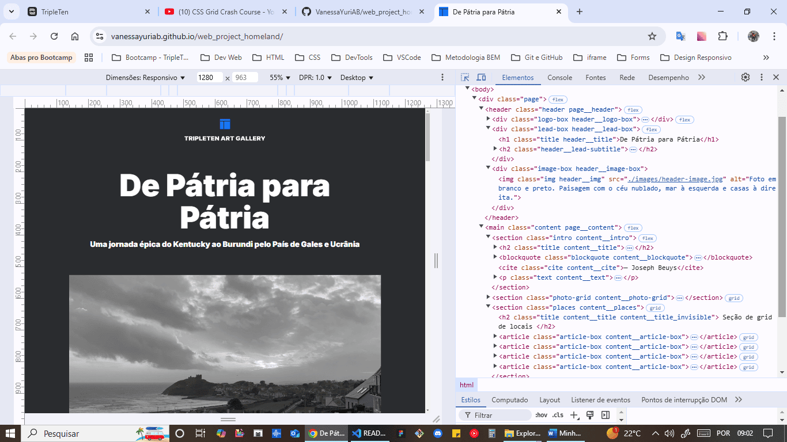
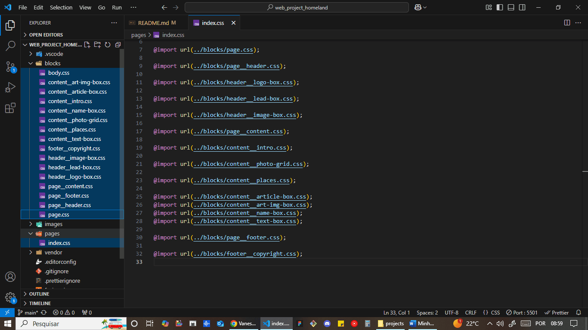

# Web_project_homeland: De Pátria para Pátria

Página web que mostra as cidades natais de alguns funcionários da TripleTen. Com HTML e CSS avançados e uso do Figma como roteiro para desenvolver layout responsivo.

Primeiro design responsivo, com pontos de interrupção para consultas de mídia fornecidos no projeto.

# Técnicas utilizadas

- HTML semântico
  

- Flexbox
  
  
  
  
  
  
  

- Metodologia BEM
  

- BEM flat
  

- @media
  
  
  
  
  
  
  
  
  
  

# GitHub Pages

https://vanessayuriab.github.io/web_project_homeland/

# Melhorias:

- Verificar e, caso necessário, adicionar pontos de interrupção para ajuste de margens e fontes entre consultas de mídia.
